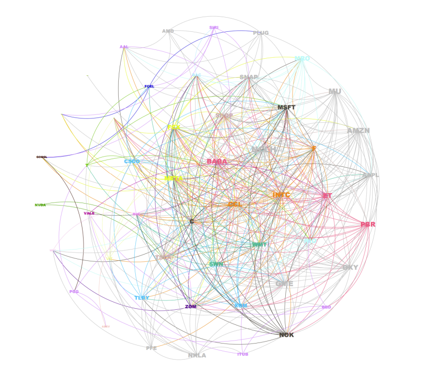
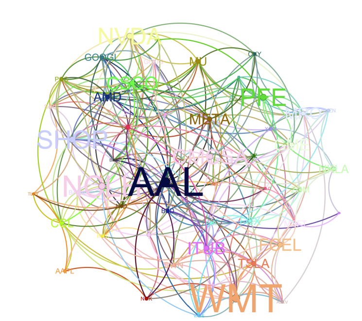
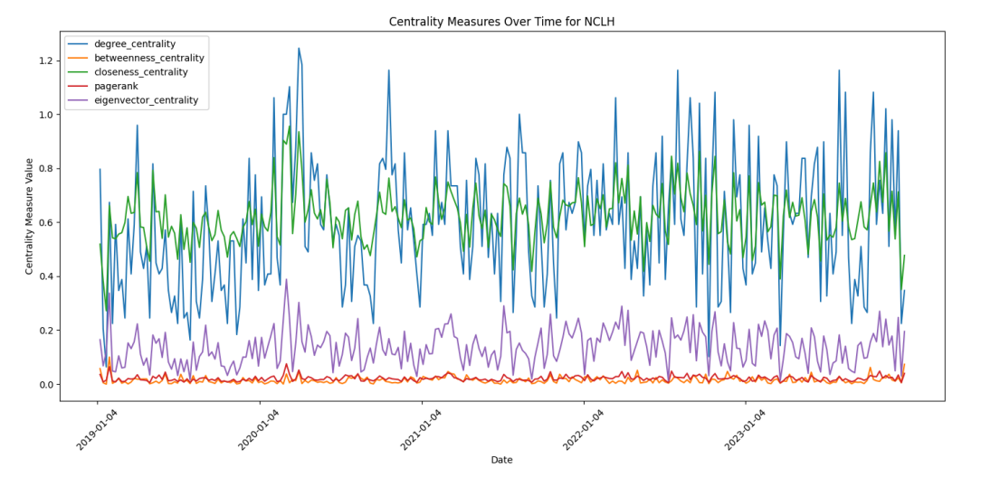
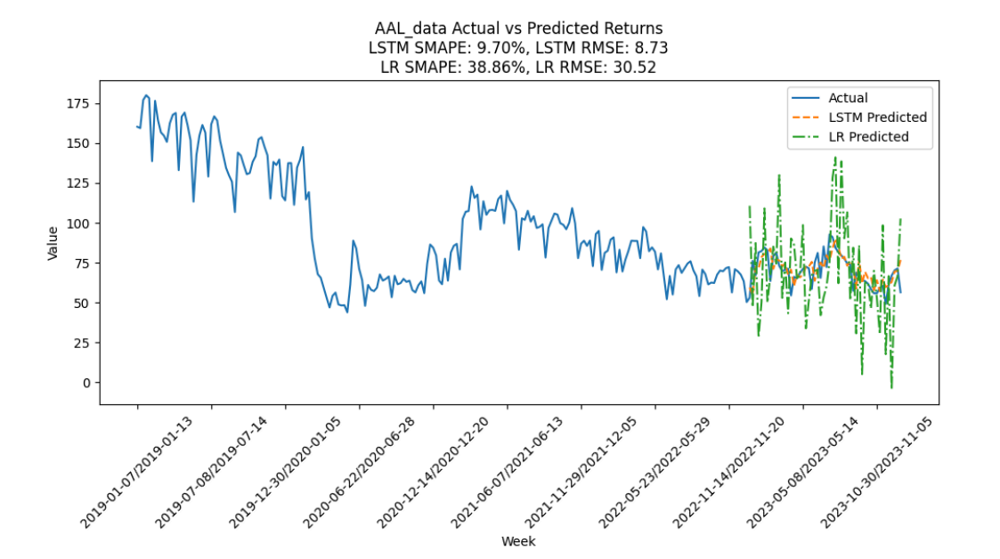
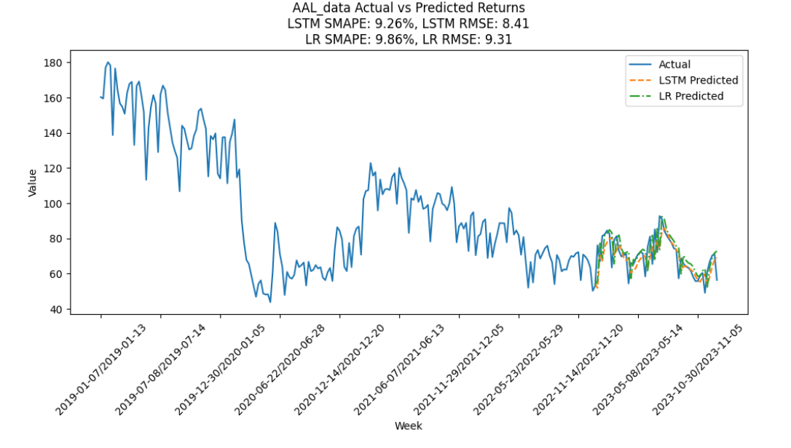

# Optimizing Stock Return Predictions Using Network Centrality Measures Based on Maximized Lagged Correlations
This project aims to optimize stock return predictions by leveraging network centrality measures based on maximized lagged correlations between stocks.

##  Project Summary

- **Timeframe**: January 1, 2019 – January 1, 2024  
- **Data Source**: Yahoo Finance  
- **Assets Analyzed**: Top 50 NYSE stocks by trading volume  
- **Target**: Weekly stock returns  
- **Key Methods**:  
  - Lagged correlation analysis  
  - Network construction with edge weights based on max correlation  
  - Centrality feature engineering  
  - Predictive modeling with LSTM and Linear Regression

## Methodology

### 1. Data Collection & Preprocessing
- Fetched daily prices for 5 years using `yfinance`
- Filtered to top 50 stocks by average volume
- Converted daily returns into **weekly returns** (Thursday-to-Wednesday)

### 2. Lagged Correlation Analysis
- Computed pairwise correlations for lags from -4 to +4 weeks
- Selected the **maximum correlation** and corresponding **lag** per pair
- Calculated **p-values** for statistical significance

### 3. Network Construction
- Created **directed and undirected graphs** using NetworkX
- Nodes: Stocks  
- Edges: Correlation strength  
  - Directed if lag ≠ 0  
  - Undirected if lag = 0  
- Filtered by correlation threshold (≥ 0.8) and p-value (≤ 0.05)

### 4. Feature Engineering
- Computed centrality measures for each stock:
  - **PageRank**
  - **Betweenness**
  - **Closeness**
  - **Eigenvector**
- Analyzed trends and statistical correlations with returns
- Normalized features for modeling

### 5. Predictive Modeling
- Developed two LSTM models:
  - With centrality measures (exogenous variables)
  - Without centrality measures (autoregressive baseline)
- Benchmarked against Linear Regression models
- Evaluated with:
  - **SMAPE** (Symmetric Mean Absolute Percentage Error)
  - **RMSE** (Root Mean Square Error)
 
## Results Snapshot

| Model                   | SMAPE (%) | RMSE   |
|------------------------|-----------|--------|
| LSTM w/ Centrality     | 11.35     | 28.26  |
| LSTM w/o Centrality    | 11.66     | 28.99  |
| Linear Regression w/ C | 41.70     | 77.08  |
| Linear Regression w/o C| 11.55     | 30.77  |

✅ LSTM benefited from centrality features  
❌ Linear Regression failed with complex (nonlinear) inputs

## Visual Highlights

  
  
  **Fig 1:** Network graphs showing the structure of stock interactions for the first week of analysis
  
  
  
  **Fig 2:** Network graphs showing the structure of stock interactions for the last week of analysis
  
  
  **Fig. 3:** Centrality measures over time for NCLH

  
  **Fig. 4:** Comparing LSTM and LR performance with centrality measures

  
  **Fig. 5:** Comparing LSTM and LR performance without centrality measures

- ## Conclusion

This project explored whether network centrality measures, derived from maximized lagged correlations between stocks, could enhance the prediction of weekly stock returns. By constructing a correlation-based stock network and extracting centrality features (e.g., PageRank, betweenness), we tested their predictive value using two models: LSTM and Linear Regression.

### Key Findings:
- **LSTM Model Performance:**
  - With centrality measures: **SMAPE = 11.35%**, **RMSE = 28.26**
  - Without centrality measures: **SMAPE = 11.66%**, **RMSE = 28.99**
  - 🔹 *Result*: Slight performance improvement, suggesting LSTM can effectively leverage complex network features.

- **Linear Regression Model Performance:**
  - With centrality measures: **SMAPE = 41.70%**, **RMSE = 77.08**
  - Without centrality measures: **SMAPE = 11.55%**, **RMSE = 30.77**
  - 🔻 *Result*: Dramatic performance drop, indicating linear models struggle with nonlinear features like centrality.

These results emphasize the importance of **model selection** and **feature engineering** in financial prediction. Centrality measures provide valuable market structure information, but only advanced models like LSTM can fully utilize them. This work highlights the potential of combining **network science** and **deep learning** for better market forecasting and opens the door for further enhancements with graph-based features.

